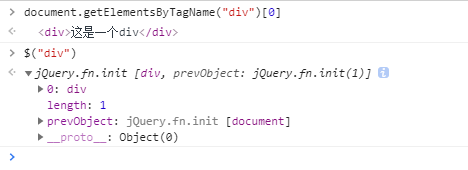

## jQuery对象

$ === jQuery

$ 是jQuery的顶级对象，可以把DOM对象包装成jQuery对象。这样才能使用jQuery提供的方法，同样的jQuery对象也不能使用原生的JS方法。



从图中可以看出jQuery对象是一个伪数组。

## 转化

尽管jQuery对象使用起来非常的方便，但是其封装的方法并不完全。有些方法只能通过原生的JS对象调用。因此，需要将jQuery对象还原为原生的JS对象。

1. DOM对象转jQuery对象

   ```javascript
   // 1.直接获取DOM元素就是jQuery对象
   $("div");
   // 2.已经通过原生js获取的DOM元素转化为jQuery对象。放到核心函数中即可，不加引号
   let myDiv = document.getElementByTagNames('div')[0];
   $(myDiv);
   ```

2. jQuery对象转DOM对象

   已知jQuery对象是一个伪数组，其下标对应的就是原生的JS对象。有两种方式可以得到原生的JS对象

   ```javascript
   $('div')[index];
   // 或者
   $('div').get(index);
   ```

   其实，就相当于取出原生对象。jQuery对象包含原生对象