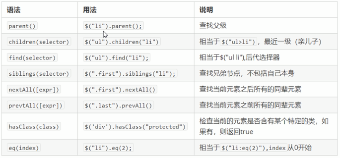

## 基本选择器

语法：

```javascript
$("选择器");
```

可以放入任何CSS的选择器，简单的和复合的选择器。

## 筛选选择器1

跟C3中的结构选择器类似，可以选出一组兄弟元素中的某一个元素


## 筛选选择器2

除了可以通过选择器获取不同的元素外，还可以用jQuery对象提供的方法



前面的是通过序号获取元素，而这个是通过元素之间的结构关系获取

补充：

parents('选择器') 方法：可以获取元素的所有外层元素，且由近到远，依次存放在一个伪数组中。它可以接受一个选择器参数，在这些祖先元素中选出符合该选择器的元素