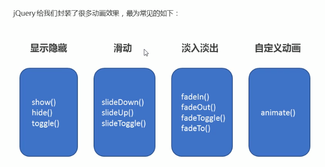

# 动画效果



## 显示隐藏

这三个方法都有三个可选的参数 `speed` `timing-function` `callback`

可以规定动画花费的时长，快慢曲线，以及执行完毕后的回调函数

通常显示隐藏都不加参数使用，直接消失或者隐藏，因为这个过程是慢慢向左上角消失，比较丑陋

## 滑动

和显示隐藏一样，三个可选的参数。

它的动画效果为上下滑动。跟拉窗帘一样

## 淡入淡出

动画效果为由慢慢变淡至透明或慢慢显形

其中 fadeIn() fadeOut() fadeToggle() 也是三个参数，和显示隐藏与滑动一样。

而 fadeTo() 方法则多了一个参数 opacity，写在 speed 的后面，值为 0-1。且 speed 和 opacity 参数必须写。表示元素变为多少透明度

## 自定义动画

```javascript
$('div').animate({
  top: '200px',
  left: '100px'
})
```

第一个参数为一个对象，里面规定执行动画效果的样式与值。后面三个参数分别为speed、timing-function、callback，这三个参数是可选的，第一个参数必须写

补充：动画里有个 scrollTop 属性也可让页面慢慢滚动到指定的位置。