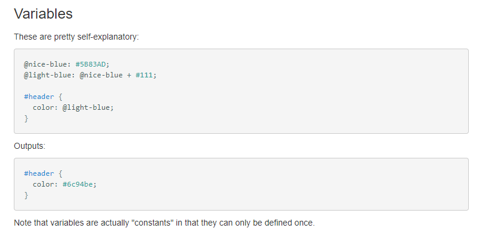
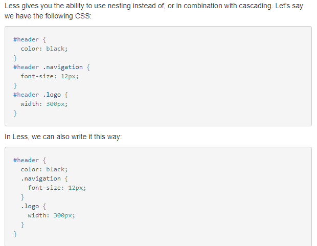
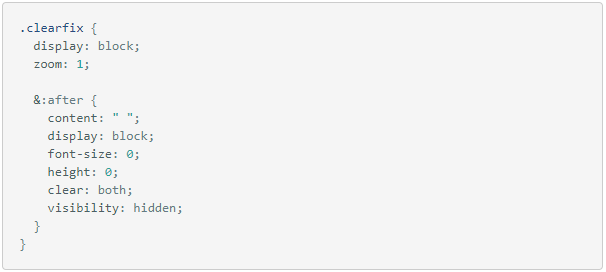
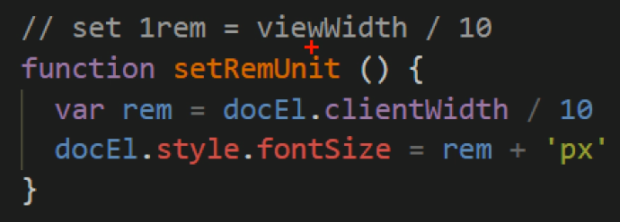
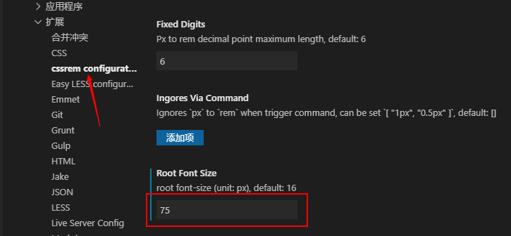

# Rem

> rem 是 C3 新增的相对长度单位，是指相对于根元素 html 的 font-size 计算值的大小。

优势：通过改变根元素 html 的 font-size 值来控制整个页面中元素和字体的大小

配合 media 媒体查询，与屏幕尺寸联系在一起，实现元素动态大小变化

## Media Query

> 可以针对不同的媒体类型（屏幕尺寸）定义不同的样式

当你重置浏览器大小的过程中，页面也会根据浏览器的宽度和高度重新渲染页面，所应用的样式就是媒体查询所匹配的样式 

```css
@media mediatype and|not|only (media feature) {
    CSS-Code;
}
```

### mediatype

| 媒体类型   | 描述                                     |
| ---------- | ---------------------------------------- |
| all        | 用于所有设备                             |
| print      | 用于打印机和打印预览                     |
| **screen** | **用于电脑屏幕，平板电脑，智能手机等。** |

### 连接关键字

将媒体类型与媒体特性连接在一起作为媒体查询的条件

| 关键字 | 描述                       |
| ------ | -------------------------- |
| and    | 将多个媒体特性连接在一起   |
| not    | 排除某个媒体类型，可以省略 |
| only   | 指定某个媒体类型，可以省略 |

### media feature

每个媒体类型都有多种媒体特性，我们可以根据不同的媒体特性设置不同的样式

| 媒体特性  | 描述                                   |
| --------- | -------------------------------------- |
| min-width | 定义输出设备中的页面最小可见区域宽度。 |
| max-width | 定义输出设备中的页面最大可见区域宽度。 |
| width     | 定义输出设备中的页面可见区域宽度。     |

都是包含等于的，分段的时候要注意错开

### 示例

```css
@media only screen and (max-width: 500px) {
  // 在宽度小于等于 500px 时 应用该样式
    .gridmenu {
        width:100%;
    }

    .gridmain {
        width:100%;
    }

    .gridright {
        width:100%;
    }
}
```

多个媒体特性继续用 and 连接

必须带单位

再写媒体查询时，为了防止混乱，推荐按从小到大的顺序写，更为简洁（利用CSS的层叠性）

### 引入资源

当样式较为复杂时，我们可以为每个媒体特性单独写一个样式表

在 link 标签引入时，根据媒体查询，引入不同的 css 文件

```css
<link rel="stylesheet" media="mediatype and|not|only (media feature)" href="style.css">
```

直接作为属性和属性值写到 link 标签中即可

## Less

Less（Leaner Style Sheets）是一门 CSS 扩展语言，也称为 CSS 预处理器

作为 CSS的一种形式上的扩展，它并没有减少 CSS 的功能，而是在现有的 CSS 语法上为 CSS 加入程序式的语言特性。引入了变量，Mixin，运算以及函数等功能，为 CSS 代码的编写提供了便捷，降低了 CSS 代码的维护成本

常见的 CSS 预处理器：Sass、Less、Stylus

less 的注释的 //

### CSS的弊端

传统的 CSS 语言，是非编程语言，没有变量、运算符以及函数等概念。

- 需要书写大量看似没有逻辑的代码，冗余度比较高
- 不方便维护和扩展
- 没有计算能力，不能用表达式表示某个值
- 如果没有经验，写出的 CSS 代码会显得杂乱无章

### Less编译

与 CSS 一样，写在一个 xxx.less 的文件中

本质上，Less 包含一套自定义的语法及配套的解析器，开发者根据这些语法定义自己的样式规则，然后通过解析器编译为 CSS 文件，如此才能应用到 html 页面中

VScode 插件 Easy Less 插件：保存 less 文件的时候会在相同的目录中生成编译好的 同名的 css 文件。即使以后修改了 less 源文件，在保存的时候也会同步修改对应的 css 文件

### Less语法

#### 声明变量



变量名必须以 @ 开头

#### less嵌套

原生的 CSS 是并列写法，不能体现出 HTML 中标签的结构关系



当遇到交集、伪类、伪元素选择器时，用 & 符号表示



如果不加 & 符号，则被解析为后代选择器

### Less运算

可以不用写确切的属性值，用**四则运算表达式**

运算符的左右需要添加一个空格

如果做运算的值都有单位，则以第一个为准。技巧：如果只有一个值有单位，而运算的结果又不想要那个单位，可以在第一个值后面强行添加需要的单位，因为计算的时候忽略单位，而结果会带第一个值的单位。

如果就一个值有单位，那么不论是不是第一个值，都会带上这个值的单位

16进制的颜色值也可以做运算。如：#666 - #222 对应位相加减

## Rem适配方案

目的：让一些需要固定大小的元素也能根据设备尺寸自适应

原理：使用媒体查询根据不同设备按比例设置 html 的字体大小，同时页面元素使用 rem 作为尺寸单位，从而实现等比例缩放的适配

还有一种 rem 适配方案：flexible.js + rem。

这两种都是主流，后者是淘宝研究出来的，更为简单易用

### 取值方法

通常屏幕宽度以 750px 为准，划分数定为 10/15/20 等

html 的 font-size 值为（屏幕宽度/划分数），即 1rem 的大小

页面元素的 rem 值为（像素值/html 的 font-size 值）

需要适配其他屏幕时，就用它的宽度除以同样的划分数得到 html 的 font-size 值。其他同理

### flexible原理



动态获取屏幕宽度，除以 10 等分（默认），然后设置给 html 的 font-size 属性。替代了手动写媒体查询的繁琐


### cssrem插件

可以在不使用 less 的情况下，自动将 px 转化为 rem

其默认的 1rem = 16px

可以在设置中修改

