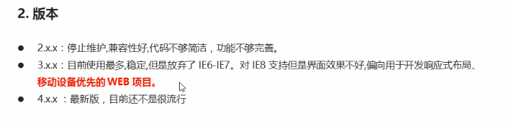
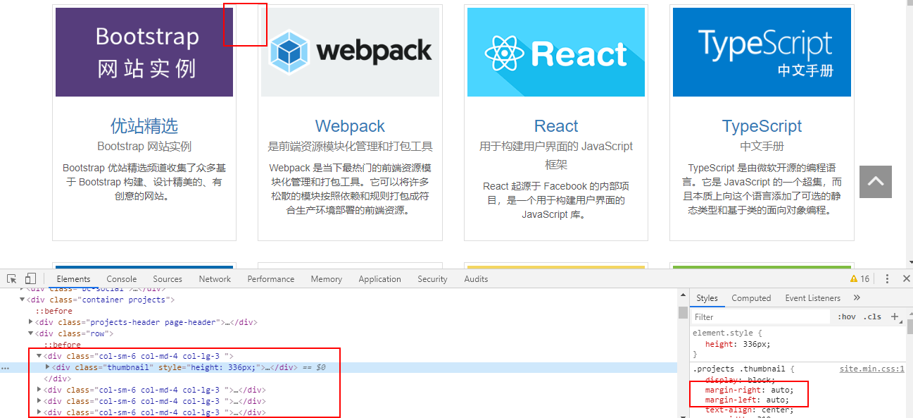
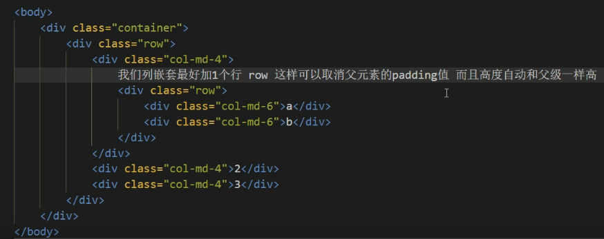
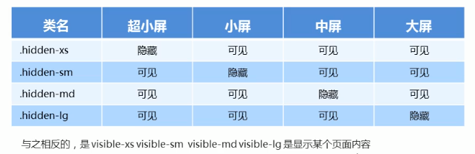

# 响应式

## 响应式开发原理

利用媒体查询，针对不宽度的设备设置不同的布局和样式

设备划分

| 设备                     | 尺寸                    | 宽度设置 |
| ------------------------ | ----------------------- | -------- |
| 超小屏幕（手机）         | width < 768px           | 100%     |
| 小屏设备（平板）         | 768px <= width < 992px  | 750px    |
| 中等屏幕（桌面显示器）   | 992px <= width < 1200px | 970px    |
| 宽屏设备（大桌面显示器） | 1200px <= width         | 1170px   |

设置宽度的时候稍小于设备尺寸，居中显示，两侧留白一部分，更为美观一些

即在每个尺寸区间内，固定页面宽度，再在不同宽度下进行布局

响应式需要一个父级元素作为容器。通过媒体查询改变这个容器的大小，再改变其子元素的排列方式和大小，从而实现不同屏幕下页面的不同布局和样式

## Bootstrap

官网： https://getbootstrap.com/ 

来自于 Twitter，是目前最受欢迎的前端框架。Bootstrap 是基于 HTML、CSS 和 JavaScript 的，简单灵活，使 Web 开发更加迅捷

简单来讲，使用 Bootstrap 就是调用的过程，它提前声明好了很多样式，只需要在自己的元素上通过 class 调用即可

优点：

1. 标准化的 HTML 和 CSS 规范
2. 提供了简洁直观的组件
3. 在不断地更新迭代
4. 提高了开发效率

Bootstrap 版本介绍

控制权在框架本身，使用者要根据其规范进行开发

通过 link 引入之后会直接对页面产生效果。如 body 背景色、内外边距以及字体等样式

Bootstrap 的样式是通过类来控制的，即使是 div 添加了按钮的 class 样式也会有按钮的效果

如果原生的 Bootstrap 样式不符合要求，可以给元素添加一个自己的类名，然后编写样式，层叠掉 Bootstrap 的样式。如果样式无效，可以提升选择器的权重或直接添加 !important 

熟练使用 Bootstrap 的关键在于，知道它定义了哪些样式，以及以及哪些样式在页面上都是怎样的效果

### 容器

bootstrap 为我们提供了响应式布局的容器 `.container` 并且预设了它的媒体查询，在不同的设备下有着不同的固定宽度（和前面表格中的划分一致）

注意点：`.container` 存在 15px 的内边距

还为我们提供了流逝布局容器 `.container-fluid` 其宽度为 100% 占据全部视口。适合于单独做移动端开发。同样的也有 15px 的内边距

### 栅格系统

> Bootstrap 提供了一套响应式、移动设备优先的**流式栅格系统**，随着屏幕或视口（viewport）尺寸的增加，系统会自动分为**最多12列**。它包含了易于使用的预定义类，还有强大的 mixin 用于生成更具语义的布局。 

栅格系统用于通过一系列的**行**（row）与**列**（column）的组合来创建页面布局，你的内容就可以放入这些创建好的布局中。 

栅格划分的是原生提供的 **容器**

讲道理，跟表格有点像

这种明显有个版心的页面可以自定义一个通栏盒子，然后让 container 容器居中。因为栅格是平均分配的，如果 container 直接设置为通栏那么宽，两端会有列浪费

以前布局一行中显示多少内容，就一直显示那么多内容，只不过是缩放了大小。而现在可以根据屏幕宽度，适当的增加或减少内容

`.row` 必须放到布局容器中

实现列的平均分配需要给列盒子添加类前缀

- xs：extra small 超小
- sm: small 小
- md: medium 中等
- lg: large 大

如果当前行的列数大于了12，多余的列会作为一个整体另起一行排列，小于12行就会空出不足的列的宽度。最好是将12份合理分配给每一列，不多也不少。

每一列默认有 15px 的左右内边距

可以为一列指定多种设备的类名，如 `class="col-md-4 col-sm-6"`

bootstrap 是通过 float 和 百分比 width 值做到让列平均分配一行显示的。想要让列与列之间有间隔，不能用 margin ，只能在每个列里面再嵌套一个小些的盒子

#### 列嵌套

每个列中如果还要分列，可以继续使用列类，同样的是将父盒子分为 12 份

#### 列偏移

常规的列是挨个儿排列的，如果希望中间间隔整数个列的距离可以使用 `-offset-份数` 

它的本质是给间隔右侧的列添加左外边距

#### 列排序

交换列之间的位置 `-push-` 和 `-pull-`

意为：将原先右侧的列 拉（pull） 到左边，拉的份数为左边列占的份数；再将左边的列 推（push） 到右边，推的份数为右边列占的份数

### 响应式工具——隐藏

bootstrap 提供了隐藏元素的工具类，可以让页面的某个模块在指定的屏幕下隐藏，其余屏幕可见

