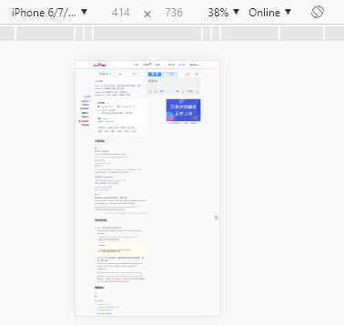
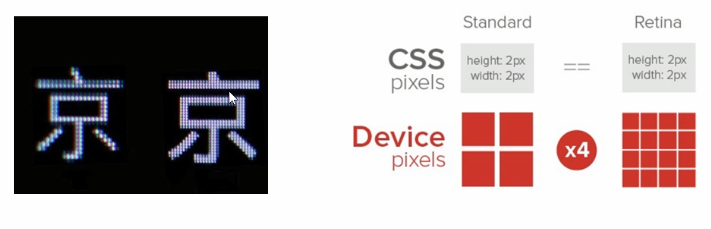
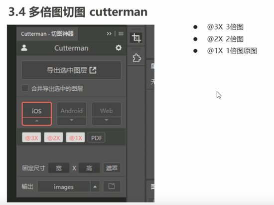

## 物理像素比

物理像素点指的是屏幕显示的最小颗粒，是物理真是存在的，即分辨率

而我们开发时的 1px 并不一定就等于设备上的 1个像素点

在 PC 端 1px 就是1个像素点，而移动端就不一定了，往往会大于1个物理像素点

1px 与 物理像素点 的个数比，就是物理像素比

chrome 调试工具上面的尺寸是开发时的像素px，而不是设备的物理像素

---

那么，为什么会有这样的现象呢？

在早期，PC 端和移动设备的屏幕中， 1px 是等于1物理像素的。但是后面出现了 Retina（视网膜屏幕），是一种显示技术，可以将更多的物理像素点压缩至一块屏幕里，从而达到更高的分辨率，提高屏幕显示的细腻程度

---

多倍图

由于 Retina 技术的存在，一张 50px * 50px 的图片会被放大两倍到三倍，相当于让50px 的宽度占满 100个像素点甚至150个像素点的宽度。这样会造成图像模糊

在标准的 viewport 设备中，使用倍图来提高图形质量，解决在高清设备中的模糊问题。将一张100x100或150x150的图设置为50px，这样即使在像素点更多的设备屏幕中也不会有模糊的问题。具体倍数根据实际开发而定

在开发中可以利用 cutterman 切出原图和相应的多倍图，且换到iOS选项就可以了

