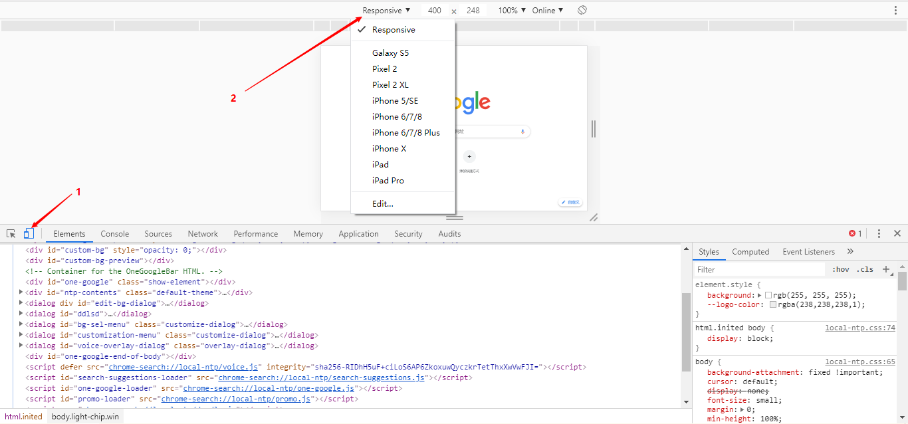

# 基础

## 现状

国内的移动端浏览器，基本都是以 webkit 为内核修改的。开发时，兼容 webkit 就好了

屏幕的尺寸和分辨率也是严重碎片化，没有统一的标准

可以放心使用H5和C3；如果需要兼容，私有前缀只考虑 -webkit-

## 调试

Chrome DevTools 模拟手机界面，调试方法和 PC 端页面一样



## 视口

viewport 就是浏览器显示页面内容的屏幕区域。视口可以分为布局视口、视觉视口和理想视口

### 布局视口（layout viewport）

通常移动设备的浏览器都默认设置了一个布局视口，用于解决早期的 PC端 页面在手机上的显示问题

iOS 和 Android 基本都将这个视口的分辨率设置为 980px，所以 PC 上的大多网页都能在手机上呈现，只不过元素看上去很小，只能通过放大局部模块来使用

## 视觉视口（visual viewport）

就是我们看到的页面区域

## 理想视口（ideal viewport）

为了使页面在移动端有最理想的浏览和阅读宽度

理想视口，对于设备来讲，是最理想的视口尺寸

需要手动添加 meta 视口标签通知浏览器操作

meta 视口标签的主要目的：布局视口的宽度应该与理想视口的宽度一致。即设备有多宽，布局视口就设置多宽

## 初始化

移动端的CSS初始化推荐使用 [normalize.css](http://necolas.github.io/normalize.css/)

- 保护了有价值的默认值
- 修复了浏览器的 BUG
- 是模块化的
- 有详细的文档

## 移动端的特殊样式

1. 取消链接点击时背景高亮

   ```css
   -webkit-tap-highlight-color: transparent;
   ```

2. 消除 iOS 上按钮和文本框特殊的样式

   ```css
   -webkit-appearance: none;
   ```

3. 禁用长按页面时弹出菜单，尤其是链接和图片

   ```
   -webkit-callout: none;
   ```

   