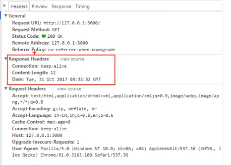
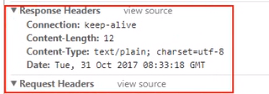

## 乱码

服务器的响应中如果有中文，客户端接收到的响应会出现乱码

其实服务器响应的内容就是 utf-8 编码的，但是浏览器不知道。

就像是html的meta标签需要设置 charset 为 utf-8 一样，编写的代码也是 utf-8 编码，但需要告诉浏览器

如果不告诉浏览器数据的编码方式，它就会按照操作系统的默认编码去解析

中文操作系统的默认编码是 gbk 。所以会出现乱码

服务器指定数据编码类型的方法是 response 对象的 setHeader 方法

```javascript
response.setHeader('Content-Type', 'text/plain; charset=utf-8')
```



如果不设置是没有Content-Type项的，而设置了之后



浏览器就是根据响应头中的信息知道该用什么编码方式解析的

`text/plain` 这个是根据响应的内容而定的，如果是html格式的字符串，那就是 `text/html` ，不指定的话虽然浏览器也会按照html解析，但是有中文依然会出现乱码。

不同的响应数据类型所对应的 Content-Type 都是有严格的规定的，可以在开源中国的使用工具中查询。链接  https://tool.oschina.net/commons 。

如果是非字符类型的数据就不用指定编码了，如 图片

其实，不用管加不加会有哪些现象，统统都加就完事了，更为严谨                         

在 http 协议中，Content-Type 就是用来告诉对方，响应的数据内容是什么类型的

在实际应用中，是根据请求的url标识，读取对应的文件内容，然后根据文件的类型设置好 Content-Type ，再响应给客户端

服务器响应的不是资源文件本身，而是其中的内容，包括图片等资源，是转化为二进制数据响应给客户端的。浏览器其实也是不认识的，需要根据Content-Type进行对应的解析处理